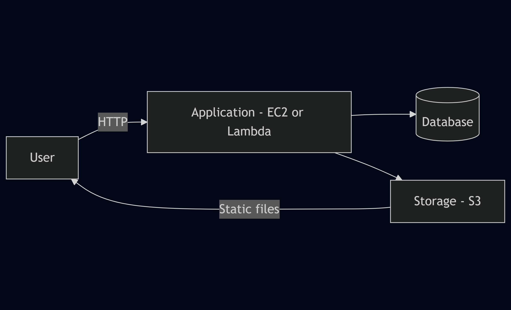

# Getting Started with AWS Cloud

© Copyright

## Table of Contents
* About AWS Cloud
* Simple architecture diagram
* Prerequisites
* Creating your AWS account
* Next steps
* FAQs
* Troubleshooting

## About AWS Cloud
AWS (Amazon Web Services) is a set of on-demand, pay-as-you-go cloud services such as:
* Virtual servers (EC2)  
* File storage (S3)  
* Managed databases (RDS)  
* Other managed services

You run applications and store data without owning hardware, scale on demand, and pay only for what you use. Key benefits: scalability, global regions, and built-in security tools.

## Simple architecture diagram

## Prerequisites
* Valid email address  
* Credit or debit card  
* Valid phone number  
* Web browser and internet access

## Creating your AWS Account
1. Open your browser and go to https://aws.amazon.com/.  
2. Click **Create account**.  
3. Enter your email in **Root user email address** and choose an **AWS account name**.  
4. Verify your email address. (Or sign in to an existing AWS account if applicable.)  
5. Verify your identity using the code sent to your phone.  
6. Choose Free or Paid account plan and click **Continue**.  
7. Add personal details and accept terms; click **Verify and continue**.  
8. Enter billing details; click **Verify and continue**.  
9. Confirm identity via SMS or voice call: select country code, enter mobile number, click **Send SMS** or **Call me now**.  
10. Enter the PIN received and select **Confirm your identity**.  
11. On Registration Confirmation, click **Go to the AWS Management Console**.

## Next steps
- Enable Multi-Factor Authentication (MFA) for account security.  
- Create an IAM user for daily use (do not use root).  
- Explore core services: EC2, S3, RDS.  
- Set billing alerts.  
- Try tutorials: https://aws.amazon.com/getting-started

## FAQs
- Q: Is there a free way to access AWS?  
  A: Yes. Use the AWS Free Tier for eligible services for a limited period.

- Q: How can I avoid unexpected charges?  
  A: Set up billing alerts and review Cost Explorer regularly.

## Troubleshooting
- Problem: Cannot sign up for an AWS account.  
  Fix: Verify phone number and billing details, try a different browser, or contact AWS Support.